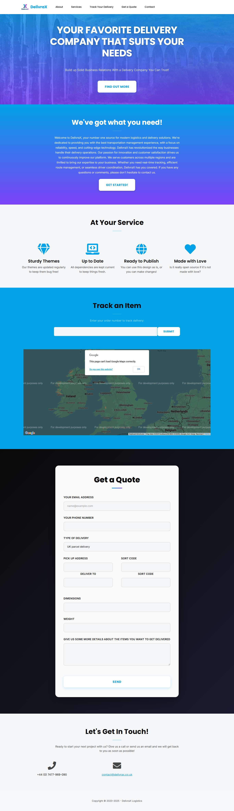
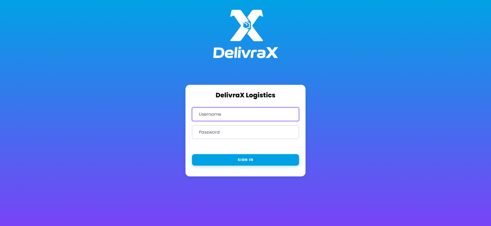
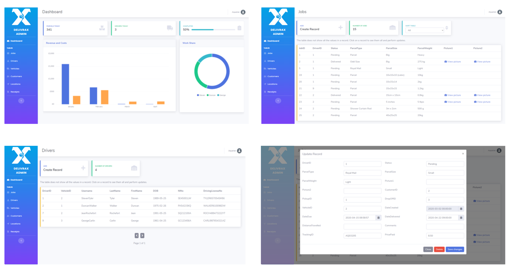
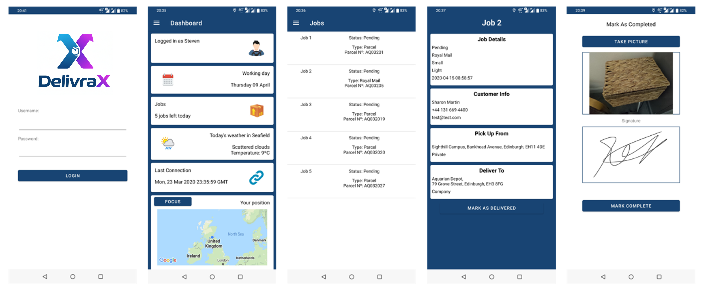
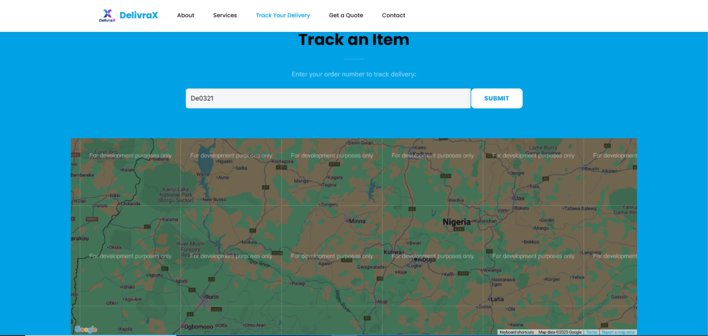

<div align="center">

# 🚚 DelivraX - Transportation Management System

### Modern, Full-Stack Delivery Management Platform

[](https://www.python.org/)
[](https://flask.palletsprojects.com/)
[](https://developer.android.com/)
[](https://www.mysql.com/)
[](LICENSE)

[Features](#-features) • [Tech Stack](#-tech-stack) • [Quick Start](#-quick-start) • [Screenshots](#-screenshots) • [Documentation](#-documentation)

</div>

---

## 📖 Overview

**DelivraX** is a comprehensive, enterprise-grade transportation management system designed for modern delivery companies. It provides a complete ecosystem for managing deliveries, drivers, customers, and business operations through an intuitive web interface and mobile application.

### 🎯 What Makes DelivraX Special?

- **🎨 Modern UI/UX**: Beautiful gradient design with DelivraX brand colors (#00A2E5 → #7B42F6)
- **📱 Mobile-First**: Native Android app for drivers with real-time updates
- **🔐 Secure**: RESTful API with authentication and role-based access control
- **📊 Business Intelligence**: Real-time revenue tracking and analytics dashboard
- **🚀 Production-Ready**: Fully functional with complete CRUD operations
- **🎓 Award-Winning**: Recognized for excellence in software engineering

---

## ✨ Features

### 🌐 Customer Website
- **Parcel Tracking**: Real-time tracking with status updates
- **Company Information**: Professional landing page with service details
- **Responsive Design**: Works seamlessly on desktop and mobile
- **Modern UI**: Gradient backgrounds and smooth animations

### 👨‍💼 Admin Panel
- **Database Management**: Full CRUD operations for all entities
- **Dashboard Analytics**: Monthly revenue, expenses, and KPIs
- **Driver Assignment**: Assign jobs and vehicles to drivers
- **Receipt Management**: View uploaded receipts and delivery photos
- **User Management**: Create and manage driver accounts
- **Professional UI**: Bootstrap-based with custom DelivraX styling

### 📱 Driver Android App
- **Job Management**: View assigned deliveries and vehicle details
- **Digital Signatures**: Capture customer signatures on delivery
- **Photo Upload**: Upload parcel photos and proof of delivery
- **Receipt Tracking**: Submit expense receipts with photos
- **Real-Time Updates**: Sync with server for latest job assignments
- **Offline Support**: View cached data when offline
- **DelivraX Branding**: Fully rebranded with modern gradient UI

### 🔌 RESTful API
- **Complete CRUD**: GET, POST, PUT, DELETE for all resources
- **JSON Responses**: Standardized response format
- **Authentication**: Secure driver login system
- **Error Handling**: Comprehensive error messages
- **Documentation**: Well-documented endpoints

---

## 🛠 Tech Stack

### Backend
- **Framework**: Flask 2.0+ (Python)
- **Database**: MySQL 8.0+
- **ORM**: Flask-MySQLdb
- **Architecture**: Blueprint-based modular design

### Frontend (Web)
- **HTML5 / CSS3**: Modern semantic markup
- **JavaScript**: ES5+ with jQuery 2.2.3
- **Bootstrap 4**: Responsive grid and components
- **AJAX**: Asynchronous data operations
- **Custom CSS**: DelivraX brand styling with gradients

### Mobile (Android)
- **Language**: Java
- **SDK**: Android API 28 (Android 9.0)
- **Networking**: Volley HTTP library
- **UI**: Material Design components
- **Architecture**: MVVM pattern

### DevOps
- **Version Control**: Git
- **Build Tool**: Gradle (Android)
- **Server**: Flask development server / WSGI production server

---

## 🚀 Quick Start

### Prerequisites
```bash
# Python 3.8+
python --version

# MySQL 8.0+
mysql --version

# Android Studio (for mobile app development)
```

### Installation

#### 1️⃣ Clone the Repository
```bash
git clone https://github.com/dfizzy247/DelivraX.git
cd DelivraX
```

#### 2️⃣ Set Up Database
```bash
# Create database
mysql -u root -p
CREATE DATABASE delivrax;
exit;

# Import schema
mysql -u root -p delivrax < scripts/setup-complete.sql
```

#### 3️⃣ Configure Environment
```bash
# Create .env file in API-and-Admin-Panel/App/App/
cat > API-and-Admin-Panel/App/App/.env << EOF
DB_HOST=localhost
DB_USER=your_mysql_user
DB_PASSWORD=your_mysql_password
DB_NAME=delivrax
SECRET_KEY=your_secret_key_here
FLASK_ENV=development
EOF
```

#### 4️⃣ Install Python Dependencies
```bash
cd API-and-Admin-Panel/App
pip install -r requirements.txt
```

#### 5️⃣ Run the Application
```bash
python run_dev.py
```

**Access the application:**
- 🌐 Customer Website: `http://localhost:5000/`
- 👨‍💼 Admin Panel: `http://localhost:5000/admin`
- 🔌 API: `http://localhost:5000/api`

**Default Admin Credentials:**
- Username: `admin`
- Password: `admin123`

#### 6️⃣ Build Android App (Optional)
```bash
cd Drivers-Android-App
./gradlew assembleDebug
# APK will be in: app/build/outputs/apk/debug/app-debug.apk
```

**Default Driver Credentials:**
- Username: Generated from driver name (e.g., "Leo" for Daniel Leo)
- Password: `DelivraX`

---

## 📸 Screenshots

### Customer Website

*Modern landing page with parcel tracking functionality*

### Admin Panel - Login

*Secure admin authentication with DelivraX branding*

### Admin Panel - Dashboard

*Real-time analytics and business intelligence*

### API Responses

*RESTful API with JSON responses*

### Driver Android App

*Native mobile app with job management and photo upload*

### Parcel Tracking

*Real-time parcel tracking for customers*

---

## 📁 Project Structure

```
DelivraX/
├── API-and-Admin-Panel/
│   └── App/
│       └── App/
│           ├── API/
│           │   └── RestAPI.py          # RESTful API endpoints
│           ├── AdminPanel/
│           │   ├── AdminPanel.py       # Admin routes
│           │   ├── static/             # CSS, JS, images
│           │   └── templates/          # HTML templates
│           ├── Website/
│           │   ├── LandingPage.py      # Customer website routes
│           │   ├── static/             # Website assets
│           │   └── templates/          # Website templates
│           ├── App.py                  # Main Flask application
│           ├── extensions.py           # MySQL connection
│           └── requirements.txt        # Python dependencies
├── Drivers-Android-App/
│   └── app/
│       └── src/
│           └── main/
│               ├── java/               # Java source code
│               └── res/                # Android resources
├── scripts/
│   └── setup-complete.sql             # Database schema
├── DELIVRAX_BRAND_GUIDE.md            # Brand guidelines
├── QUICK_START_GUIDE.md               # Detailed setup guide
└── README.md                          # This file
```

---

## 🔌 API Endpoints

### Jobs
```
GET    /api/jobs              # Get all jobs
GET    /api/jobs/<id>         # Get specific job
POST   /api/jobs              # Create new job
PUT    /api/jobs/<id>         # Update job
DELETE /api/jobs/<id>         # Delete job
```

### Drivers
```
GET    /api/drivers           # Get all drivers
POST   /api/drivers           # Create driver
GET    /api/drivers/<id>      # Get driver details
PUT    /api/drivers/<id>      # Update driver
POST   /api/drivers/login     # Driver authentication
GET    /api/drivers/assigned/<id>  # Get assigned jobs
```

### Customers
```
GET    /api/customers         # Get all customers
POST   /api/customers         # Create customer
PUT    /api/customers/<id>    # Update customer
DELETE /api/customers/<id>    # Delete customer
```

### Vehicles
```
GET    /api/vehicles          # Get all vehicles
POST   /api/vehicles          # Create vehicle
PUT    /api/vehicles/<id>     # Update vehicle
DELETE /api/vehicles/<id>     # Delete vehicle
```

### Receipts
```
GET    /api/receipts          # Get all receipts
POST   /api/receipts          # Create receipt
POST   /api/receipts/uploads  # Upload receipt image
GET    /api/receipts/driver/<id>  # Get driver receipts
```

**Full API documentation available in the code comments.**

---

## 🎨 Design System

### Brand Colors
```css
Primary Blue:    #00A2E5
Electric Purple: #7B42F6
Gradient:        linear-gradient(90deg, #00A2E5 0%, #7B42F6 100%)
Background:      #F5F6F8
Dark Text:       #0A0A0A
```

### Typography
- **Web**: Poppins, Inter, -apple-system, BlinkMacSystemFont
- **Android**: Roboto (system default)

### Components
- Gradient buttons with elevation
- Card-based layouts
- Smooth transitions (0.3s cubic-bezier)
- Responsive breakpoints (Bootstrap 4)

---

## 🔧 Configuration

### Database Configuration
Edit `API-and-Admin-Panel/App/App/App.py`:
```python
app.config['MYSQL_HOST'] = os.getenv('DB_HOST', 'localhost')
app.config['MYSQL_USER'] = os.getenv('DB_USER', 'root')
app.config['MYSQL_PASSWORD'] = os.getenv('DB_PASSWORD', '')
app.config['MYSQL_DB'] = os.getenv('DB_NAME', 'delivrax')
```

### Android App Configuration
For emulator testing, the app uses `10.0.2.2:5000` (emulator's localhost alias).

For physical device testing, update URLs in Java files to your PC's IP address.

---

## 🧪 Testing

### Web Application
```bash
# Start development server
python run_dev.py

# Access admin panel
http://localhost:5000/admin
```

### Android App
```bash
# Build debug APK
cd Drivers-Android-App
./gradlew assembleDebug

# Install on emulator
adb install app/build/outputs/apk/debug/app-debug.apk
```

### API Testing
Use Postman, curl, or browser for API testing:
```bash
# Get all jobs
curl http://localhost:5000/api/jobs

# Driver login
curl "http://localhost:5000/api/drivers/login?Username=Leo&Password=DelivraX"
```

---

## 🤝 Contributing

Contributions are welcome! Please follow these guidelines:

1. Fork the repository
2. Create a feature branch (`git checkout -b feature/AmazingFeature`)
3. Commit your changes (`git commit -m 'Add some AmazingFeature'`)
4. Push to the branch (`git push origin feature/AmazingFeature`)
5. Open a Pull Request

### Development Guidelines
- Follow PEP 8 for Python code
- Use ESLint for JavaScript
- Follow Material Design for Android UI
- Maintain DelivraX brand consistency
- Add comments for complex logic
- Update documentation for new features

---

## 🐛 Known Issues & Roadmap

### Known Issues
- [ ] Admin panel requires hard refresh after CSS changes (browser caching)
- [ ] Android app requires x86_64 emulator (ARM not supported on Intel/AMD PCs)

### Roadmap
- [ ] Add real-time notifications (WebSockets)
- [ ] Implement route optimization algorithm
- [ ] Add customer mobile app (iOS & Android)
- [ ] Integrate payment gateway
- [ ] Add multi-language support
- [ ] Implement advanced analytics dashboard
- [ ] Add automated testing suite
- [ ] Docker containerization
- [ ] CI/CD pipeline setup

---

## 📄 License

This project is licensed under the MIT License - see the [LICENSE](LICENSE) file for details.

---

## 👨‍💻 Author

**DFizzy**
- GitHub: [@dfizzy247](https://github.com/dfizzy247)
- Project: [DelivraX](https://github.com/dfizzy247/DelivraX)

---

## 🏆 Acknowledgments

- **Napier University** - For the Group Project Awards recognition
- **Original Contributors** - For the foundational codebase
- **Open Source Community** - For the amazing tools and libraries

---

<div align="center">

### ⭐ Star this repo if you find it useful!

**Built with ❤️ using Flask, Android, and MySQL**

[⬆ Back to Top](#-delivrax---transportation-management-system)

</div>
